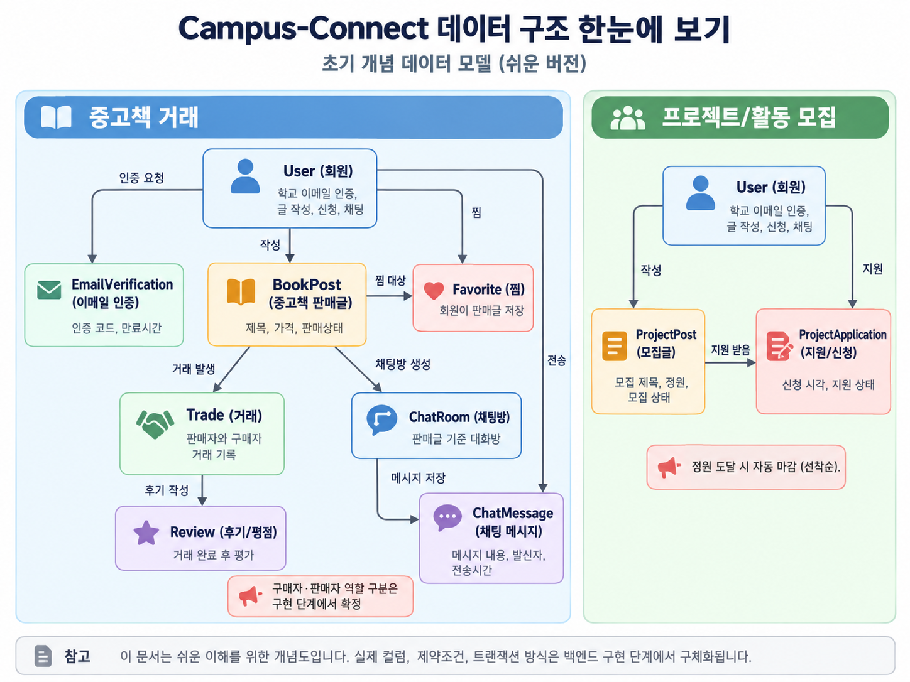
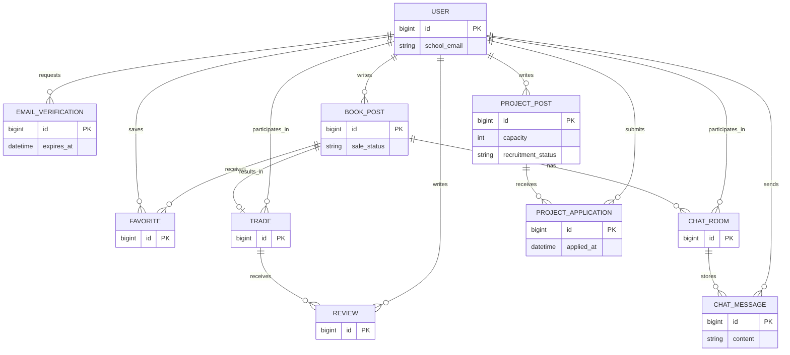

# 초기 데이터 모델 초안 (v0.1)

이 문서는 **초기 데이터 모델 초안이며 백엔드 구현 과정에서 변경될 수 있습니다.** 팀원이 기능과 데이터 관계를 함께 검토하기 위한 자료입니다. 아래 속성은 개념을 설명하기 위한 최소 예시이며 확정된 DB 스키마가 아닙니다.

## 쉬운 버전 개념도

주요 데이터와 연결을 쉽게 살펴보기 위한 참고용 개념도입니다. 확정된 DB 설계가 아니며, 자세한 관계와 검토 사항은 아래 내용을 함께 확인해 주세요.

## 관계도

## 엔티티

| 엔티티 | 역할 |
| --- | --- |
| `User` | 회원과 학교 이메일 인증 상태를 관리 |
| `EmailVerification` | 학교 이메일 인증 요청, 코드와 만료 시각을 관리 |
| `BookPost` | 중고책 판매글과 판매 상태를 관리 |
| `Favorite` | 회원이 찜한 판매글을 연결 |
| `Trade` | 판매글의 거래와 구매자·판매자를 연결 |
| `Review` | 완료된 거래에 대한 후기와 평점 |
| `ChatRoom` | 판매글을 중심으로 구매자와 판매자가 대화하는 방 |
| `ChatMessage` | 채팅방의 발신자와 메시지 내용을 저장 |
| `ProjectPost` | 프로젝트·활동 모집글, 정원과 모집 상태를 관리 |
| `ProjectApplication` | 회원의 모집 신청과 신청 시각을 기록 |

## 핵심 제약과 검토 사항

- 판매글은 판매 상태를 관리하며, 거래 완료된 책은 다시 판매 중으로 보이지 않게 합니다. 상태 이름과 전환 규칙은 구현 단계에서 정합니다.
- 한 판매글에 완료 거래가 중복 생성되지 않도록 합니다. `Trade`를 별도 테이블로 둘지 등은 백엔드 담당자가 확정합니다.
- 동일 회원의 같은 판매글 찜 및 같은 모집글 신청은 중복되지 않도록 합니다.
- 모집은 정원 이내에서 선착순으로 접수하고, 정원에 도달하면 자동 마감합니다. 동시 신청 처리와 정원 계산 방식은 백엔드 담당자가 정합니다.
- 실시간 채팅 메시지는 전송 후에도 조회할 수 있도록 저장합니다. 채팅방의 참여자는 해당 판매글의 구매 희망자와 판매자로 제한하는 방향으로 검토합니다.
- 리뷰는 완료된 거래를 바탕으로 작성합니다. 작성 가능 인원과 횟수는 팀에서 정합니다.
- 이미지 업로드 데이터는 현재 범위에 포함하지 않습니다.
- 이메일 인증은 회원가입 완료 전에도 수행될 수 있으므로, `EmailVerification`과 `User`의 연결 시점과 방식은 회원가입 흐름을 설계하면서 확정합니다.
- 거래에서는 판매자와 구매자의 역할을 구분해야 하며, `Trade`에서 판매자와 구매자를 어떤 방식으로 참조할지는 백엔드 구현 단계에서 확정합니다.
- 채팅방은 판매글의 판매자와 구매 희망자 사이의 대화를 기준으로 하며, 참여자를 `ChatRoom`에서 직접 관리할지 별도 참여자 구조를 둘지는 구현 단계에서 확정합니다.

세부 컬럼, 인덱스, 상태값, 트랜잭션 방식은 백엔드 담당자가 구현 과정에서 확정합니다.
